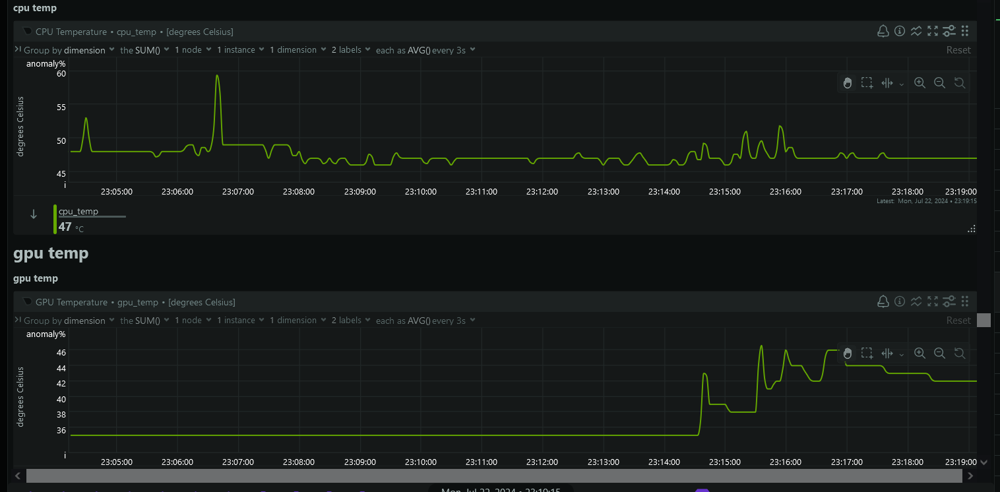

# Netdata collector scripts
Example temperature collector for netdata agent

Add the .charts.d files in `/usr/libexec/netdata/charts.d/` then enable them in `/etc/netdata/charts.d.conf` by adding a `chart_name = yes` at the bottom of the file.

The example provided is a collector mitigating the buggyness of `lm-sensors` which returned temperatures of over 100 degrees Celsius. It uses native command `landscape-syinfo` as well as the `nvidia-smi` utility to monitor actual temperatures directly.

